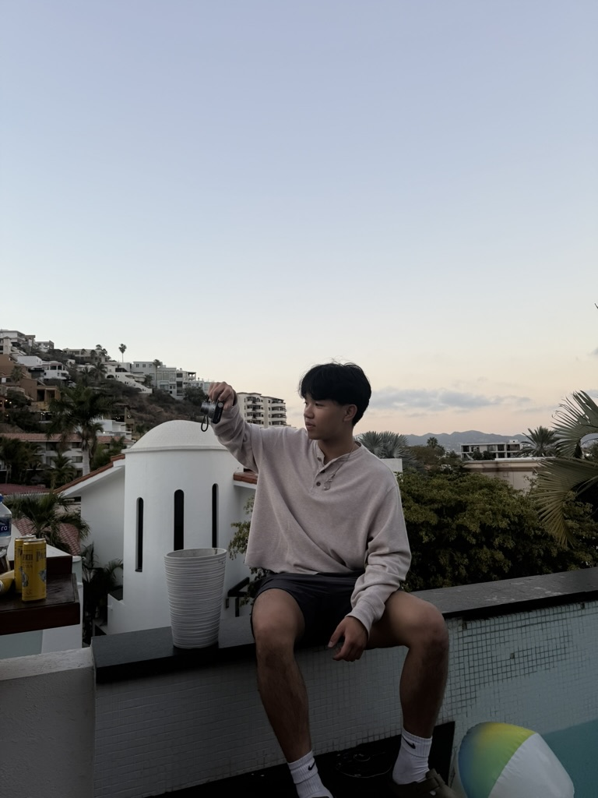

# Brendan Nguyen



## About Me
Hi! I'm Brendan and my goal is to become a Software Engineer 
in order to make a positive impact on the world. More 
specifically, I want to tackle problems in the spheres related 
to health, poverty, and the environment.

### As a **Programmer**

I love learning about:
- web development
* full stack development
+ UI/UX Design
- Startups!

### As a **Person**

I *LOVE*:
1. Basketball
2. Music
3. Fashion
4. Photography/Videography
5. The gym
6. ~~Matcha~~

## Quote I live by:
> Carpe Diem

## For my Favorite Coding Lanugage
[Go to README](README.md)

## Favorite Code Quote:
```
git status
git add .
git commit -m "GO WARRIORS!"
git push
```

## Favorite Song of All Time
[Jukebox Joints by A$AP Rocky](https://www.youtube.com/watch?v=lNq2ZN2IpoA)
 
## Fun Fact
My favorite artist is **_Brent Faiyaz_**.

## Programming Fun Fact
I am currently working on a website for my own fashion brand!

## What my Ideal Day Looks Like
- [x] Wake Up
- [x] Gym
- [x] Basketball
- [x] Lunch
- [x] Cafe
- [x] Watch the Sunset on the Beach
- [ ] More Basketball
- [ ] Concert
- [ ] Dinner with Friends
- [ ] MATCHA!!!!! 

## To show that I am not performative, I mentioned matcha before [Matcha is part of my identity](#as-a-person) 

